# pkm-ai-interface

This repository contains a proof-of-concept "Roam MCP Proxy" that lets a Custom GPT securely read from and write to a shared Roam Research graph. It provides infrastructure, Lambda container code, and documentation for deploying the proxy and managing access.



See [docs/architecture.md](docs/architecture.md) for a detailed overview of the components and deployment steps.

## Deployment

1. Build the Lambda container image:
   ```bash
   docker build -t roam-mcp-proxy ./src
   ```
2. Provision AWS resources with Terraform:
   ```bash
   cd infra
   terraform init
   terraform apply
   ```

## Development

   
### Project Structure   
```
/infra  - infrastructure-as-code
/src    - Lambda application source
/tests  - test suites
/docs   - project documentation
```

### Configuration

Copy `.env.example` to `.env` and provide the values for the variables below:

- `ROAM_API_BASE` – Base URL of your deployed MCP proxy
- `ROAM_API_TOKEN` – API token used for Authorization header

### Local development

1. Install dependencies:
   ```bash
   python -m pip install -r requirements.txt
   ```
2. Run the unit tests:
   ```bash
   pytest
   ```
   Moto is used to mock AWS services.

3. Format and lint the code:
   ```bash
   ruff .
   black .
   ```
4. Run `scripts/setup.sh` to install Docker (requires sudo privileges).
5. Build the Lambda container image:
   ```
   docker build -t roam-mcp-proxy ./src
   ```
6. Optional: run the container locally (requires Docker daemon):
   ```
   docker run --rm -p 9000:8080 roam-mcp-proxy
   ```
   
See [`docs/SECRET_RETRIEVAL.md`](docs/SECRET_RETRIEVAL.md) for information about the secret loader utility.

### Running smoke tests

The `tests/smoke/test_fetch_and_append.py` test issues a simple create-and-fetch workflow against a deployed proxy. Export the base URL of your deployment as `ROAM_API_BASE` (or load it from a `.env` file) and run:

```bash
pytest tests/smoke/test_fetch_and_append.py -k prod
```

## OpenAPI schema generation

1. Start the MCP container locally:
   ```bash
   docker run -p 8088:8088 roam-research-mcp:0.3.x
   ```
2. Run the helper script (optionally set `MCP_URL` or `DOCS_DIR`):
   ```bash
   MCP_URL=http://localhost:8088/openapi.json \
   ./scripts/generate_openapi.sh
   ```
   It fetches the schema from the container and writes a trimmed version to
   `docs/openapi_trim.json` containing only the endpoints required by the Custom GPT.

Run the script manually and verify that `docs/openapi_trim.json` is created.
For an automated check, run:
```bash
pytest -k generate_openapi
```

See [`docs/OPENAPI_SPEC.md`](docs/OPENAPI_SPEC.md) for an overview of the trimming approach and a description of the included endpoints.

The long-term goal is a production-ready proxy with full observability and analytics of all calls.

## Creating a Custom GPT

1. In ChatGPT, open **Explore GPTs** and choose **Create**.
2. Upload `docs/openapi_trim.json` when configuring Actions.
3. Set the base URL to your deployed API Gateway URL (`ROAM_API_BASE`).
4. Under Authentication, add the header `Authorization: Bearer <ROAM_API_TOKEN>`.
5. Share the GPT only with the two whitelisted users.

## AWS Lambda Application

This repository contains a minimal AWS Lambda application used as a proof of concept for the Roam MCP proxy. The function exposes an `/analytics/log` endpoint that records structured events to Amazon Kinesis Firehose.

The Lambda expects the environment variable `FIREHOSE_STREAM_NAME` to be set to the name of the delivery stream. Requests should include a valid Cognito `sub` claim which is used as the `user_id` for analytics.

```
POST /analytics/log
{
  "action": "test"
}
```

A `timestamp` is added server-side and the record is forwarded to Firehose.


## TODO

Unit tests currently stub the Firehose client. Future work includes:

- Add integration tests against a real Firehose endpoint or moto-based mock.
- Expand IAM policies and Terraform to support production deployment.
- Remove dummy credentials and use environment-specific configuration.

