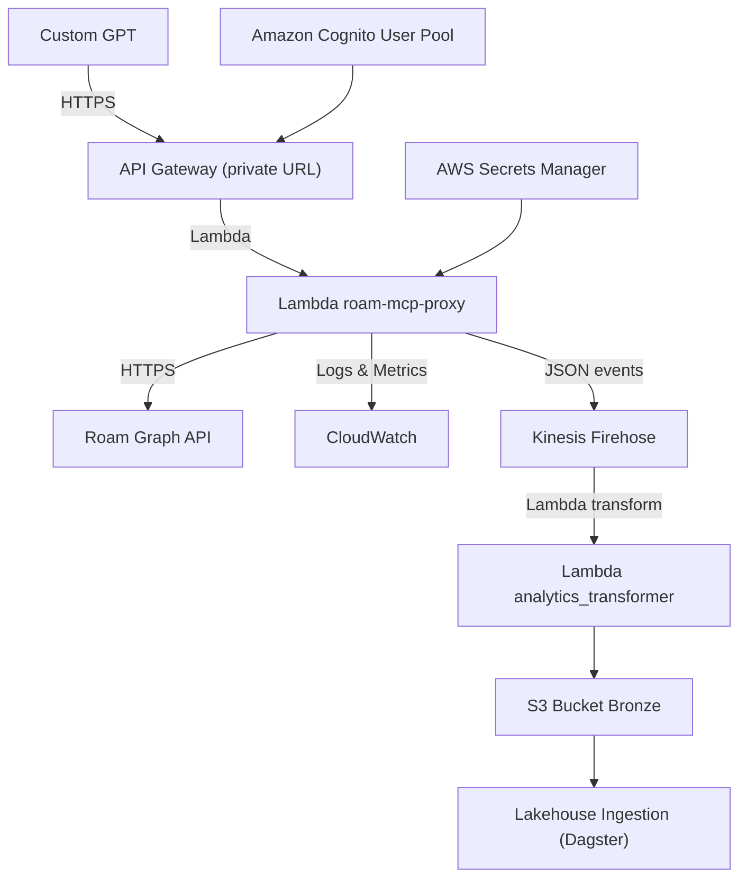

# Architecture



The Roam MCP Proxy connects a Custom GPT to a shared Roam Research graph through AWS infrastructure.

## Components

- **Custom GPT** – uses `/roam` and `/analytics/log` actions.
- **API Gateway** – private HTTP API that fronts the proxy.
- **Lambda `roam-mcp-proxy`** – containerized Python 3.12 function running `roam-research-mcp`.
- **Roam Graph API** – upstream API used to read and write graph data.
- **Amazon Cognito User Pool** – authenticates the two whitelisted users.
- **AWS Secrets Manager** – stores the Roam API token referenced by
  `ROAM_API_SECRET_NAME`.
- **Lambda `analytics_transformer`** – enriches analytics events with a
  processing timestamp before delivery.
- **Kinesis Firehose → S3** – streams analytics events into the Lakehouse.

## Deployment Guide

1. **Create & Store Roam Secret**
   ```bash
   aws secretsmanager create-secret \
     --name roam/prod/apiToken \
     --secret-string '{"token":"<token>"}'
   ```
   Set the `ROAM_API_SECRET_NAME` environment variable to the secret name so the
   proxy can load the token at startup.
2. **Build the Lambda container**
   ```bash
   docker build -t roam-mcp-proxy ./src
   ```
3. **Provision infrastructure**
   ```bash
   cd infra
   terraform init
   terraform apply
   ```
4. **Generate OpenAPI schema (optional)**
   ```bash
   docker run -p 8088:8088 roam-research-mcp:0.3.x
   MCP_URL=http://localhost:8088/openapi.json ./scripts/generate_openapi.sh
   ```

See [`README.md`](../README.md) for running tests and creating the Custom GPT.
